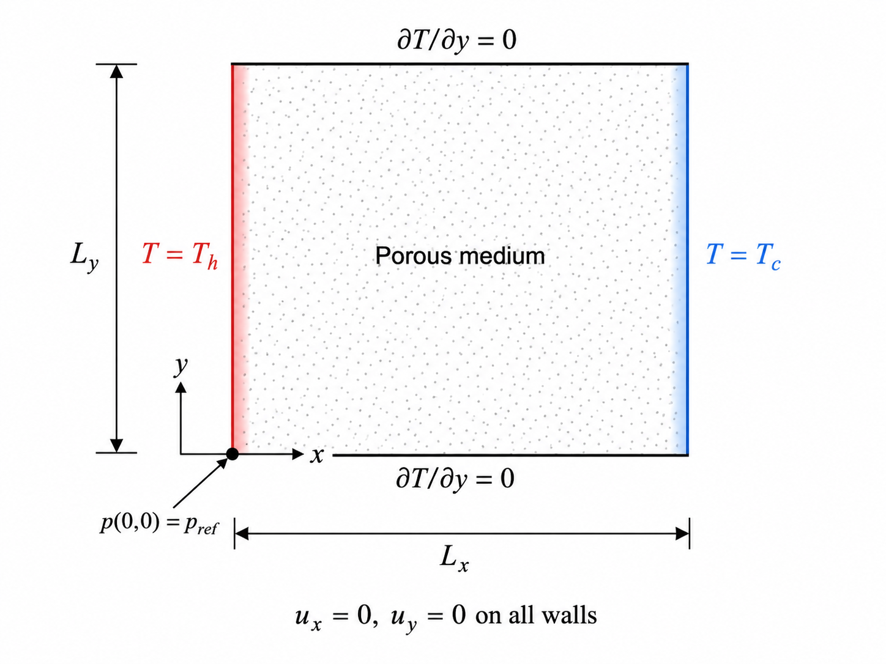
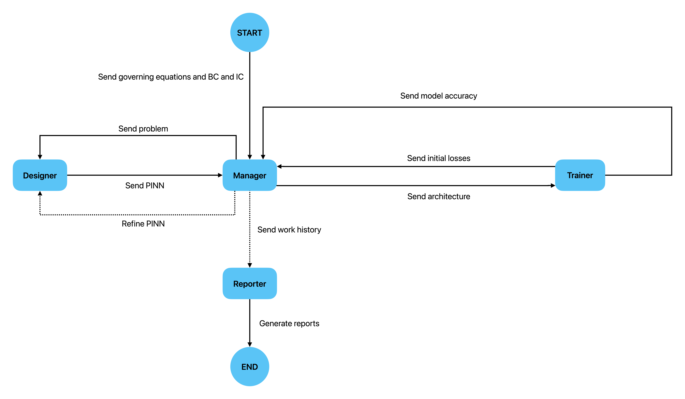
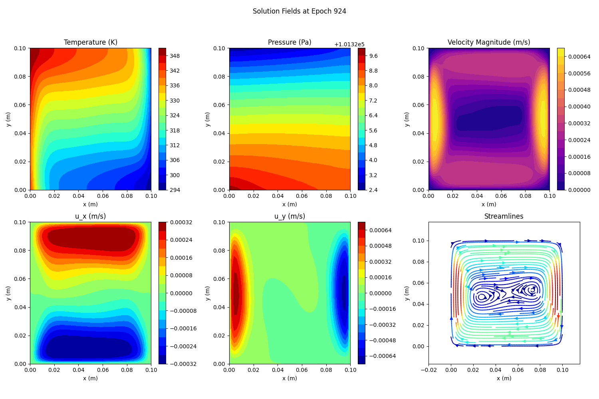

# AgentPINN: Multi-Agent Automated Design for PINNs 🚀

**Notice:** The code and methodology in this repository are part of the paper:
> *"A Multi-Agent Framework for Automated Design and Training of Physics-Informed Neural Networks: Application to Natural Convection in Porous Media"* 

> **Status:** Submitted to *Engineering Applications of Artificial Intelligence* (Under Review, July 2026).

---

## 📖 Overview
Architecting a Physics-Informed Neural Network (PINN) typically relies on heavy human heuristic tuning. This project introduces an autonomous, LLM-driven **Multi-Agent System** that collaboratively designs, trains, and validates PINNs without human intervention. 

*Figure 1: Schematic of the natural convection problem in a porous medium.*

Instead of blind trial-and-error, specialized agents reason about the physics, propose network architectures, execute the training loop, and use engineering solvers (like COMSOL) as **verifiable supervisors (rewards)** to validate the network's outputs.

## 📄 Abstract
Physics-Informed Neural Networks (PINNs) have emerged as a promising approach for solving engineering problems governed by partial differential equations. However, their performance strongly depends on network architecture selection, hyperparameter tuning, and the appropriate weighting of different loss-function components, which are often determined manually through expert experience and extensive trial and error. 

The main novelty of this study is the development of a Large Language Model (LLM)-based multi-agent framework for automating the design, training, and evaluation of PINNs. In the proposed framework, specialized agents with coordinated operational logic propose network architectures, define training strategies, support the weighting of physics-based loss terms, monitor the learning process, evaluate model performance, and generate structured scientific reports. 

To evaluate the framework, it is applied to a thermo-fluid problem involving heat transfer and natural convection in a porous medium, governed by the Brinkman–Boussinesq equations. Its performance is validated using 10,000 COMSOL Multiphysics reference points that were not used during training. The results show relative errors of approximately 1% for temperature and 0.5% for pressure, demonstrating that a systematically designed PINN can accurately reconstruct complex physical behaviors while reducing reliance on manual tuning.

## 🧠 The Multi-Agent Architecture
The proposed framework consists of four specialized agents with coordinated operational logic:

1. **The Manager Agent:** Coordinates the overall workflow of the framework. It defines the high-level objectives, manages interactions among agents, and determines whether a newly proposed architecture should be trained, refined, or passed to the reporting stage based on the obtained results.
2. **The Designer Agent:** Responsible for proposing candidate PINN configurations. Based on the problem definition and feedback from previous training attempts, it suggests suitable fully connected network architectures and training-related settings. The proposed configuration is then sent to the Manager in a structured format.
3. **The Trainer Agent:** Performs the computational training and evaluation. Given a candidate network architecture, it initializes the PINN model, generates interior collocation and boundary points, computes physics-based losses, and executes the predefined optimization procedure. Finally, it evaluates the best model using reference validation data and returns error metrics to the workflow.
4. **The Reporter Agent:** Organizes the outputs generated during the entire workflow (including the selected architectures, training logs, and final error metrics) into a structured scientific report.

*Figure 2: Schematic illustration of the proposed multi-agent system and the interaction workflow among agents.*

## 🔬 Key Results
* **Accuracy:** Successfully modeled natural convection in porous media, reproducing reference COMSOL Multiphysics results with **< 1% error**.
* **Automation:** Eliminated manual hyperparameter tuning by allowing agents to autonomously iterate based on verifiable physical constraints.

*Figure 3: Predicted solution fields (Temperature, Pressure, Velocity) generated by the agent-designed PINN.*

## 🛠️ Tech Stack
* **Deep Learning:** PyTorch
* **Agent Orchestration:** LangChain
* **Physics Modeling:** COMSOL Multiphysics (for reference validation)

---
**Note on Code Availability:** 

As the associated manuscript is currently under peer review, this repository contains the core architectural components. The complete training datasets, pre-trained weights, and full reproduction scripts will be made publicly available upon publication of the paper.
